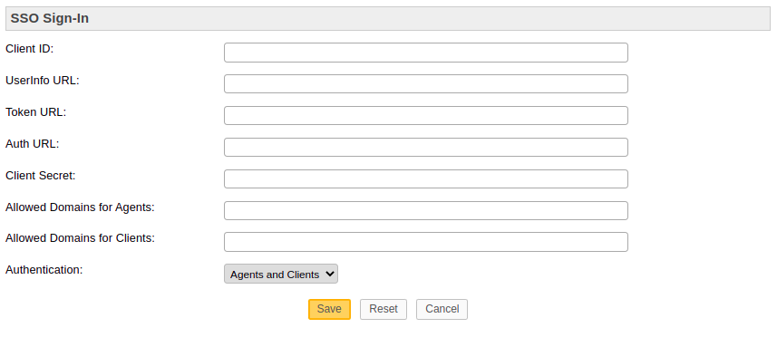

## osticket-oidc-plugin
A simple OSTicket plugin for authenticating users third party oidc providers. This plugins extends the [gmail authentication plugin](https://github.com/osTicket/osTicket-plugins/tree/develop/auth-oauth) and provides a generic interface in order to connect with every oidc provider. This plugin has been tested with Keycloak v18.0 .

## Installation process
Just place the files of this project into the Osticket plugin folder. Enable the new plugin as described in [official documentation](https://docs.osticket.com/en/latest/Admin/Manage/Plugins.html).

## Settings
You need to fill in some basic settings in order the plugin to work properly. These settings are :

1. Client Id: as provided by your OIDC.
2. UserInfo URL: The complete URL for retrieveving the user information by your oidc provider (usually like "oidc-domain/realms/myrealm/protocol/openid-connect/userinfo").
3. Token URL: The complete URL for generating access token in your oidc provider (usually like "oidc-domain/realms/myrealm/protocol/openid-connect/token").
4. Auth URL: The authorization endpoint (usually like "oidc-domain/realms/myrealm/protocol/openid-connect/auth").
5. Client Secret: as provided by your OIDC.
6. Allowed Domains for Agents/Clients: Restict access to specific domains (comma seperated).
7. Authentication: Agents or/and Clients. Enable the OIDC authorization mechanism for agents or/and clients.

## Credits
Thanks to: https://github.com/osTicket/osTicket-plugins/tree/develop/auth-oauth